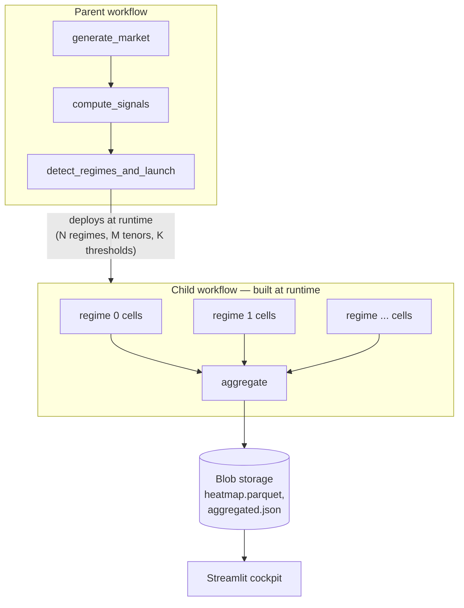

# Gas Curve Backtest on Datatailr

End-to-end backtester for a commodity-curve trading desk. Mirrors the
problem Marco described on the call: stack-model-priced forward curves,
ECMWF-driven signals, distribution percentile and asymmetry filters, and
a search for **profitable thresholds** to filter and size trades.

The point of the demo is not the strategy itself — it is to show four
Datatailr capabilities at once:

1. **Workflows-as-DAGs** with automatic dependency inference.
2. **Dynamic / branching workflows**: a task at runtime computes how many
   regimes / cells to backtest and **deploys a brand-new child workflow**
   with that exact shape.
3. **Elastic scale-out**: same Numba kernel runs in 1 process on a
   laptop and across N containers on the platform.
4. **Hosted Streamlit cockpit** that reads the same blob layout the
   workflow writes — so the dashboard works against either run mode.



## Folder layout

```text
gas_curve_backtest/
  deploy.py                       # workflow + dashboard deployment
  local_run.py                    # laptop-mode benchmark
  metadata.json
  requirements.txt

  market/                         # synthetic but credible inputs
    stack_model.py                # merit-order clearing price
    ecmwf_simulator.py            # ensemble weather forecasts
    curve_generator.py            # forward curve history

  signals/
    percentile_signals.py         # market vs model percentile
    asymmetry.py                  # P90-P50 / P50-P10
    short_term.py                 # ECMWF anomaly z-score

  backtest/
    core.py                       # @njit single-cell backtest
    metrics.py                    # Sharpe / DD / hit rate
    grid.py                       # threshold grid (regime-aware)

  workflows/
    parent_workflow.py            # entrypoint, declares 3 stages
    regime_workflow.py            # built at runtime by parent
    tasks.py                      # @task implementations
    blob_paths.py                 # single source of truth for keys

  dashboard/
    app.py                        # Streamlit landing page
    _storage.py                   # Blob shim (works locally too)
    pages/
      1_Run_Backtest.py           # configure & launch (laptop or platform)
      2_Live_Progress.py          # workflow stage tracker
      3_Threshold_Heatmap.py      # the answer Marco wants
      4_Regime_Drilldown.py       # equity curves and per-regime stats
```

## Demo flow (45 minutes)

| Time   | Step                                                                               | What it proves                            |
| ------ | ---------------------------------------------------------------------------------- | ----------------------------------------- |
| 0–5    | Open dashboard, point out stack-pricing / ECMWF / asymmetry vocabulary             | We listened to the call                   |
| 5–10   | "Run on laptop" with a small grid (≈ 250 cells, single process, ~30–60 s)          | His current pain                          |
| 10–15  | "Run on Datatailr" — full grid, same code                                          | Trivial deployment of his Python+Numba    |
| 15–25  | Watch parent DAG; **child DAG materialises** when `detect_regimes` finishes        | Branching / dynamic workflows             |
| 25–30  | Show the autoscaler bringing up VMs and shutting down                              | Elastic scale, cost story                 |
| 30–35  | *Threshold Heatmap* + *Regime Drilldown* in the cockpit                            | Answers his actual quant question         |
| 35–45  | Q&A; offer to swap synthetic feed for EEX/NBP if they share a data source          | Low switching cost                        |

## Run it

### Local

```bash
pip install -r gas_curve_backtest/requirements.txt
python -m gas_curve_backtest.local_run --n-days 500 --sig-steps 7 --pivot-steps 3
streamlit run gas_curve_backtest/dashboard/app.py
```

The dashboard reads from `/tmp/gas_curve_backtest/` when no Datatailr
job context is detected, so you can develop offline.

### On Datatailr

```bash
cd gas_curve_backtest
python deploy.py                # deploy parent workflow + dashboard
python deploy.py run            # also kick off one parent run
```

After `deploy.py run`, the parent workflow generates the market data,
computes signals, then deploys a fresh child workflow whose **shape
depends on the regimes detected at runtime**. Watch it in the platform
UI — the new DAG will appear once `detect_regimes_and_launch` completes.

## Speaking to Marco's specific points

| Marco said                                                          | What to point at                                        |
| ------------------------------------------------------------------- | ------------------------------------------------------- |
| "I price futures with a stack model"                                | `market/stack_model.py`                                 |
| "Signals come from ECMWF forecasts"                                 | `market/ecmwf_simulator.py`, `signals/short_term.py`    |
| "We compute percentiles of market prices in our distribution"       | `signals/percentile_signals.py`                         |
| "Each signal has its own asymmetry / risk-reward"                   | `signals/asymmetry.py`, used as the position-sizing pivot |
| "Asymmetry changes with each forecast — we can't predict beforehand"| `workflows/parent_workflow.py` -> `regime_workflow.py` (built at runtime) |
| "Need a real threshold to filter and size trades"                   | `dashboard/pages/3_Threshold_Heatmap.py`                |
| "Optimised with Numba on a single laptop"                           | `backtest/core.py` (same kernel runs in containers)     |
| "Streamlit dashboard"                                               | `dashboard/` (deployed via `App(framework="streamlit")`) |

## Configuration knobs

The dashboard exposes the four most-relevant knobs (trading days,
tenors, regime count, grid size). For headless runs, the same
parameters are accepted by `parent_backtest_workflow(...)` and
`run_locally(...)`.

A practical default sweep is **4 regimes × 8 tenors × 11 × 5 cells =
1 760 cells**. On Datatailr this fans out across containers; on a
laptop it runs sequentially in a few minutes.

## Notes

- The child workflow is deployed at runtime by calling the
  `@workflow`-decorated function from inside a running `@task`. The
  Datatailr SDK detects the child invocation and submits a new Batch
  via the same code path used by `parent_workflow.py`.
- The dashboard reads cell results directly from Blob storage rather
  than depending on the workflow runtime, so it remains useful even
  while a run is mid-flight.
- All paths are computed by `workflows/blob_paths.py`. To swap to a
  real data feed (EEX gas, NBP, etc.), replace `generate_market` —
  every downstream stage already operates on the same dictionary.
