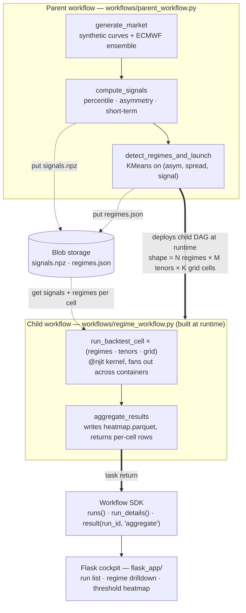

# Gas Curve Backtest on Datatailr

End-to-end backtester for a commodity-curve trading desk. Mirrors the
problem Marco described on the call: stack-model-priced forward curves,
ECMWF-driven signals, distribution percentile and asymmetry filters, and
a search for **profitable thresholds** to filter and size trades.

The point of the demo is not the strategy itself — it is to show four
Datatailr capabilities at once:

1. **Workflows-as-DAGs** with automatic dependency inference.
2. **Dynamic / branching workflows**: a task at runtime computes how many
   regimes / cells to backtest and **deploys a brand-new child workflow**
   with that exact shape.
3. **Elastic scale-out**: same Numba kernel runs in 1 process on a
   laptop and across N containers on the platform.
4. **Hosted Flask cockpit** that reads runs and per-task results back
   from the platform via the `Workflow` API — `runs()`,
   `run_details()`, and `result()` — so the dashboard reflects exactly
   what the scheduler stored, without any blob-storage scraping.


```mermaid
flowchart TD
    subgraph Parent["Parent workflow — workflows/parent_workflow.py"]
        direction TB
        GM["generate_market<br/>synthetic curves + ECMWF ensemble"]
        CS["compute_signals<br/>percentile · asymmetry · short-term"]
        DR["detect_regimes_and_launch<br/>KMeans on (asym, spread, signal)"]
        GM --> CS --> DR
    end

    Blob[("Blob storage<br/>signals.npz · regimes.json")]
    CS -. "put signals.npz" .-> Blob
    DR -. "put regimes.json" .-> Blob

    DR ==>|"deploys child DAG at runtime<br/>shape = N regimes × M tenors × K grid cells"| Child

    subgraph Child["Child workflow — workflows/regime_workflow.py (built at runtime)"]
        direction TB
        Cells["run_backtest_cell × (regimes · tenors · grid)<br/>@njit kernel, fans out across containers"]
        Agg["aggregate_results<br/>writes heatmap.parquet, returns per-cell rows"]
        Cells --> Agg
    end

    Blob -. "get signals + regimes per cell" .-> Cells

    Agg ==>|"task return"| SDK["Workflow SDK<br/>runs() · run_details() · result(run_id, 'aggregate')"]
    SDK --> Dash["Flask cockpit — flask_app/<br/>run list · regime drilldown · threshold heatmap"]
```

## Folder layout

```text
gas_curve_backtest/
  deploy.py                       # workflow + dashboard deployment
  local_run.py                    # laptop-mode benchmark
  metadata.json
  requirements.txt

  market/                         # synthetic but credible inputs
    stack_model.py                # merit-order clearing price
    ecmwf_simulator.py            # ensemble weather forecasts
    curve_generator.py            # forward curve history

  signals/
    percentile_signals.py         # market vs model percentile
    asymmetry.py                  # P90-P50 / P50-P10
    short_term.py                 # ECMWF anomaly z-score

  backtest/
    core.py                       # @njit single-cell backtest
    metrics.py                    # Sharpe / DD / hit rate
    grid.py                       # threshold grid (regime-aware)

  workflows/
    parent_workflow.py            # entrypoint, declares 3 stages
    regime_workflow.py            # built at runtime by parent
    tasks.py                      # @task implementations
    blob_paths.py                 # blob layout for the signals.npz handoff

  flask_app/
    app.py                        # Flask routes + JSON APIs
    workflow_io.py                # Workflow().runs() / run_details() / result()
    templates/
      base.html
      overview.html               # run list + launch form
      run_detail.html             # parent + child tasks, regimes, heatmap
    static/
      style.css
      app.js
```

## Demo flow (45 minutes)

| Time   | Step                                                                               | What it proves                            |
| ------ | ---------------------------------------------------------------------------------- | ----------------------------------------- |
| 0–5    | Open Flask cockpit, point out stack-pricing / ECMWF / asymmetry vocabulary         | We listened to the call                   |
| 5–10   | "Launch new run" with a small grid (≈ 250 cells, single process, ~30–60 s)         | His current pain                          |
| 10–15  | Launch full grid on Datatailr — same code                                          | Trivial deployment of his Python+Numba    |
| 15–25  | Watch parent run; **child run materialises** when `detect_regimes` finishes        | Branching / dynamic workflows             |
| 25–30  | Show the autoscaler bringing up VMs and shutting down                              | Elastic scale, cost story                 |
| 30–35  | Per-run threshold heatmap (regime × tenor) in the cockpit                          | Answers his actual quant question         |
| 35–45  | Q&A; offer to swap synthetic feed for EEX/NBP if they share a data source          | Low switching cost                        |

## Run it

### Local benchmark

```bash
pip install -r gas_curve_backtest/requirements.txt
python -m gas_curve_backtest.local_run --n-days 500 --sig-steps 7 --pivot-steps 3
```

The local runner is for sanity-checking the kernels; the Flask cockpit
talks exclusively to the platform's Workflow API and needs to run
inside a Datatailr-connected environment to see runs.

### On Datatailr

```bash
cd gas_curve_backtest
python deploy.py                # deploy parent workflow + Flask cockpit
python deploy.py run            # also kick off one parent run
```

After `deploy.py run`, the parent workflow generates the market data,
computes signals, then deploys a fresh child workflow whose **shape
depends on the regimes detected at runtime**. Watch it in the platform
UI — the new DAG will appear once `detect_regimes_and_launch` completes.

## Speaking to Marco's specific points

| Marco said                                                          | What to point at                                        |
| ------------------------------------------------------------------- | ------------------------------------------------------- |
| "I price futures with a stack model"                                | `market/stack_model.py`                                 |
| "Signals come from ECMWF forecasts"                                 | `market/ecmwf_simulator.py`, `signals/short_term.py`    |
| "We compute percentiles of market prices in our distribution"       | `signals/percentile_signals.py`                         |
| "Each signal has its own asymmetry / risk-reward"                   | `signals/asymmetry.py`, used as the position-sizing pivot |
| "Asymmetry changes with each forecast — we can't predict beforehand"| `workflows/parent_workflow.py` -> `regime_workflow.py` (built at runtime) |
| "Need a real threshold to filter and size trades"                   | `flask_app/templates/run_detail.html` (heatmap)         |
| "Optimised with Numba on a single laptop"                           | `backtest/core.py` (same kernel runs in containers)     |
| "We want a hosted dashboard"                                        | `flask_app/` (deployed via `App(framework="flask")`)    |

## Configuration knobs

The cockpit's *Launch new run* form exposes the four most-relevant
knobs (trading days, tenors, regime count, grid size). For headless
runs, the same parameters are accepted by `parent_backtest_workflow(...)`
and `run_locally(...)`.

A practical default sweep is **4 regimes × 8 tenors × 11 × 5 cells =
1 760 cells**. On Datatailr this fans out across containers; on a
laptop it runs sequentially in a few minutes.

## How the cockpit fetches results

`flask_app/workflow_io.py` is a thin layer over the Datatailr SDK:

- `Workflow(name="Gas Curve Backtest — Parent", get_existing=True)` →
  open a handle to the deployed parent.
- `wf.runs()` → list every parent run with state and timestamps.
- `wf.run_details(run_id)` → per-task state for that run.
- `wf.result(run_id, task_name="detect_regimes_and_launch_child")` →
  the regime summary and the deterministic child workflow name.
- The same APIs on the child workflow give us the per-task states and
  the `aggregate` task's full return value (every per-cell metric row).

Because everything flows through task return values, the cockpit shows
exactly what the scheduler stored and never has to reconcile blob
listings with workflow state.

## Notes

- The child workflow is deployed at runtime by calling the
  `@workflow`-decorated function from inside a running `@task`. The
  Datatailr SDK detects the child invocation and submits a new Batch
  via the same code path used by `parent_workflow.py`.
- `signals.npz` is still written to Blob storage — the parent and the
  dynamically-deployed child are separate DAGs, so the cells need a
  durable handoff for the input arrays.
- To swap to a real data feed (EEX gas, NBP, etc.), replace
  `generate_market` — every downstream stage already operates on the
  same dictionary.
