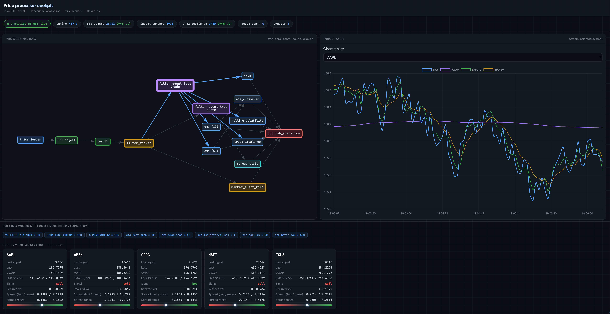
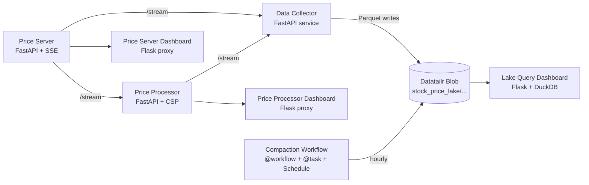
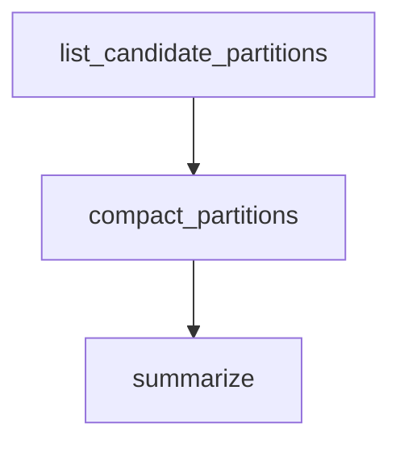
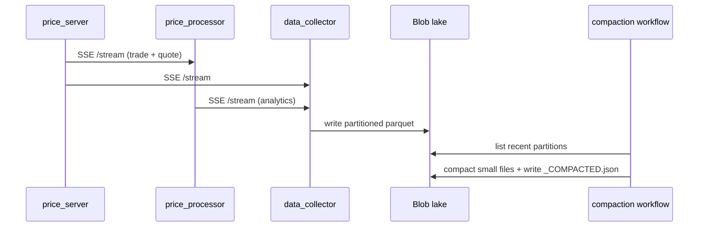

# Stock Price Processing on Datatailr

An end-to-end market data demo that generates synthetic exchange events, computes realtime analytics, persists a partitioned lake, and compacts small files with a scheduled workflow.

This project is designed to show how Datatailr makes multi-job deployment and orchestration straightforward using a small set of primitives.



## What this project contains

At a high level, the system has four layers:

1. **Market simulation** (`price_server`)  
   Emits synthetic trade/quote events over SSE.
2. **Realtime analytics** (`price_processor`)  
   Consumes SSE events and computes per-ticker metrics in a CSP graph.
3. **Lake ingestion and query** (`data_collector`, `lake_query`)  
   Buffers events into Parquet partitions in Blob storage and queries with DuckDB.
4. **Operational UIs and maintenance** (`price_server_dashboard`, `price_processor.dashboard`, `lake_query.dashboard`, `compaction_workflow`)  
   Dashboards for visibility, plus an hourly compaction workflow to keep the lake healthy.

## Architecture



## Datatailr components used

This demo intentionally uses the core Datatailr building blocks:

- `Service`  
  Deploy long-running processes (`price_server`, `price_processor`, `data_collector`) with restart behavior and resource isolation.
- `App`  
  Deploy Flask apps (`price_server_dashboard`, `price_processor_dashboard`, `lake_dashboard`) as web UIs.
- `workflow` + `task`  
  Define DAG-style orchestration for periodic compaction in `compaction_workflow`.
- `Schedule`  
  Trigger compaction at minute `0` of each hour.
- `Resources`  
  CPU/memory sizing per service/app/workflow stage.
- `Blob`  
  Durable object storage for the data lake and compaction marker files.
- `User`  
  Optional user ribbon enrichment in dashboard UIs from Datatailr request context.

### Why this makes deployment and orchestration easy

- **Single Python deploy surface:** infra and code live together in `deploy.py`.
- **Per-job runtime packaging:** each service/app/workflow declares `python_requirements`.
- **Built-in scheduling:** no extra scheduler infrastructure required for hourly jobs.
- **Composable DAG tasks:** compaction logic is split into discover -> compact -> summarize.
- **Storage abstraction:** lake code reads/writes through `Blob()` with no external SDK glue.
- **Environment-aware URLs:** components resolve local vs deployed endpoints via Datatailr env vars.

## Repository structure

```text
stock_price_processing/
  deploy.py                           # Datatailr Services + Apps + workflow entrypoint
  requirements.txt                    # Runtime deps
  screenshot.png

  price_server/
    server.py                         # Synthetic exchange feed (FastAPI, SSE)
    demo_client.py

  price_processor/
    server.py                         # CSP analytics engine + API + SSE
    dashboard.py                      # Flask dashboard app for processor observability
    templates/processor.html

  data_collector/
    service.py                        # SSE consumer, buffering, partitioned Parquet sink

  lake_query/
    reader.py                         # Blob traversal + Parquet loading + DuckDB query helpers
    dashboard.py                      # Flask SQL/query + blob browser UI
    templates/lake_dashboard.html

  price_server_dashboard/
    monitoring.py                     # Flask monitor + ticker management + SSE proxy
    templates/index.html
    templates/tickers.html

  compaction_workflow/
    tasks.py                          # @task discovery/compaction/summary logic
    deploy.py                         # @workflow hourly schedule wiring
```

## Component walkthrough

### 1) Price Server (`price_server/server.py`)

- FastAPI service that simulates market microstructure for multiple tickers.
- Generates two event types on `/stream` (SSE):
  - `trade`: ticker, price, size, side, seq, timestamp
  - `quote`: bid/ask/mid/spread + quote-side fields
- Exposes operational endpoints:
  - `/tickers`, `/add/{ticker}`, `/remove/{ticker}`, `/quote/{ticker}`, `/__health_check__.html`

### 2) Price Processor (`price_processor/server.py`)

- Consumes `price_server` SSE and runs a realtime CSP graph per ticker.
- Computes analytics:
  - VWAP
  - EMA(10), EMA(50)
  - EMA crossover signal (`buy`/`sell`)
  - rolling volatility
  - trade imbalance
  - spread min/max/mean
- Publishes 1 Hz snapshots:
  - `/analytics` and `/analytics/{ticker}` (latest state)
  - `/stream` (SSE analytics snapshots)
  - `/topology`, `/stats` for observability and dashboard graphing

### 3) Data Collector (`data_collector/service.py`)

- Subscribes to both streams:
  - market events from `price_server`
  - analytics snapshots from `price_processor`
- Buffers in memory and flushes to Parquet on interval/threshold.
- Writes Hive-style partitions to Blob:

```text
stock_price_lake/
  analytics/dt=YYYY-MM-DD/hour=HH/ticker=TICKER/part-<ns>.parquet
  market_events/dt=YYYY-MM-DD/hour=HH/ticker=TICKER/part-<ns>.parquet
```

### 4) Lake Query (`lake_query/reader.py`, `lake_query/dashboard.py`)

- Uses `Blob().ls/get_blob` to discover and fetch Parquet files.
- Uses DuckDB in-memory query execution over downloaded partition subsets.
- Supports partition pruning by `dataset`, `dt`, `hour` for efficiency.
- Dashboard provides:
  - Blob browser
  - SQL form and tabular results
  - Collector status panel

### 5) Dashboards

- `price_server_dashboard/monitoring.py`: live market stream monitor + ticker CRUD UI.
- `price_processor/dashboard.py`: processor metrics/topology/stats stream UI.
- `lake_query/dashboard.py`: lake explorer and SQL query interface.

All three are Datatailr `App` deployments with Flask.

### 6) Compaction Workflow (`compaction_workflow`)

- Hourly scheduled workflow (`Schedule(at_minutes=[0])`).
- Task stages:
  1. `list_candidate_partitions`: find recent dataset/dt/hour/ticker partitions
  2. `compact_partitions`: merge many small files into one compact Parquet
  3. `summarize`: report action counts
- Idempotency is enforced via marker file:
  - `_COMPACTED.json` per compacted partition
- Handles both legacy and current partition layouts.

## Orchestration graph





## Deployment wiring (`deploy.py`)

`deploy.py` defines:

- Datatailr `Service` jobs:
  - Price Server
  - Price Processor
  - Stock data collector
- Datatailr `App` jobs:
  - Price Server Dashboard
  - Lake Query Dashboard
  - Price Processor Dashboard
- Scheduled Datatailr workflow:
  - Stock Lake Hourly Compaction

This keeps service topology, UI deployment, and periodic maintenance in one place.

## Runtime configuration

Key environment variables used across components:

- `PRICE_SERVER_URL`
- `PRICE_PROCESSOR_URL`
- `DATA_COLLECTOR_URL`
- `COLLECTOR_BLOB_PREFIX` (default: `stock_price_lake`)
- `COLLECTOR_FLUSH_INTERVAL_SEC`
- `COLLECTOR_MAX_BUFFER_ROWS`
- `COMPACTION_LAST_N_HOURS`
- `COMPACTION_MIN_FILES`
- `COMPACTION_DRY_RUN`

## Local development notes

- Install deps: `pip install -r stock_price_processing/requirements.txt`
- Main service ports:
  - `8080` price server
  - `8081` price processor
  - `8082` data collector
  - `5050` price server dashboard
  - `5060` lake dashboard
  - `5070` processor dashboard

In local mode, services automatically fall back to `localhost` URLs when `DATATAILR_JOB_TYPE` is unset or `workstation`.

## Operational outcomes

This project demonstrates a complete pattern for production-like market pipelines:

- realtime ingest and analytics over SSE
- durable lake storage in partitioned Parquet
- SQL-accessible historical data
- scheduled compaction for long-term storage hygiene
- deployable services, apps, and workflows from a single Python codebase
