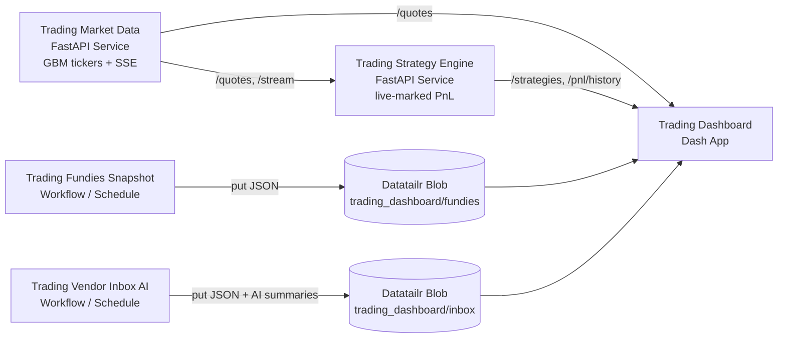

# Trading Dashboard on Datatailr

End-to-end demo of a buy-side trading dashboard built on Datatailr. It
addresses the two main areas:

1. **A web page hosting the firm's strategies, PnL, and fundamentals**, designed
   from day one to support live ticking (the same UI works against static
   blob snapshots and against real-time services).
2. **An AI tool that scans external vendor emails and produces summaries**,
   exposed in the same dashboard as a "Vendor Inbox AI" tab.

Everything required to **generate** the data, **persist** it and **serve** it
is included here -- there are no external dependencies on third-party
market-data, fundamentals or email feeds, so the demo runs out of the box.

## Architecture



## Datatailr building blocks used

| Component                  | Datatailr primitive | Purpose                                                              |
|----------------------------|---------------------|----------------------------------------------------------------------|
| `market_data_service`      | `Service`           | Long-running synthetic exchange feed (REST + SSE).                   |
| `strategy_engine`          | `Service`           | Long-running PnL engine; polls market data, marks positions live.    |
| `fundies_workflow`         | `workflow` + `Schedule` | Daily snapshot of fundamentals into blob storage.                |
| `email_workflow`           | `workflow` + `Schedule` | Periodic vendor-email ingestion + AI summarisation into blob.    |
| `dashboard`                | `App` (Dash)        | Operator-facing UI consuming all of the above.                       |
| Datatailr `Blob`           | data plane          | Durable storage for fundies snapshots and the AI inbox.              |
| Datatailr `Secrets`        | secrets manager     | Optional `OPENAI_API_KEY` for the email summarizer.                  |

## Repository layout

```text
trading_dashboard/
  deploy.py                          # Datatailr deployment entrypoint
  requirements.txt                   # Runtime dependencies
  universe.py                        # Shared ticker + vendor universe

  market_data_service/
    service.py                       # FastAPI + SSE ticking quotes

  strategy_engine/
    strategies.py                    # Hard-coded strategy book (positions)
    service.py                       # FastAPI; polls market data, marks PnL

  fundies_workflow/
    tasks.py                         # @task: generate + publish fundamentals
    deploy.py                        # @workflow + Schedule (weekday 06:30 UTC)

  email_workflow/
    generator.py                     # Synthetic vendor-email generator
    summarizer.py                    # OpenAI summarizer + heuristic fallback
    tasks.py                         # @task: fetch -> summarize -> publish
    deploy.py                        # @workflow + Schedule (every 15 min)

  dashboard/
    app.py                           # Dash multi-tab app
```

## Component walkthrough

### 1. `market_data_service` (Service)

A FastAPI service that ticks every symbol in `universe.py` forward through
a Geometric-Brownian-Motion model. Exposes:

- `GET /quotes`                   - all symbols, latest BBO + change since open
- `GET /quotes/{ticker}`          - single symbol
- `GET /tickers`                  - symbol list
- `GET /stream`                   - Server-Sent Events publishing the entire tape after every tick
- `GET /health`                   - platform health probe

The tick interval (default 1.0s) is controlled by `MARKET_TICK_INTERVAL_SEC`.

### 2. `strategy_engine` (Service)

A FastAPI service that owns the firm's hard-coded strategy book
(`strategy_engine/strategies.py`). It polls the market-data service every
`ENGINE_POLL_INTERVAL_SEC` (default 1s), marks every position to market and
keeps a rolling in-memory PnL history (default 600 samples = 10 minutes).

Endpoints:

- `GET /strategies`               - per-strategy and aggregate metrics, latest snapshot
- `GET /strategies/{name}`        - one strategy detail
- `GET /pnl/summary`              - aggregate PnL/exposure
- `GET /pnl/history`              - rolling PnL series per strategy + total (used by the chart)
- `GET /health`                   - platform health probe

### 3. `fundies_workflow` (Workflow / scheduled)

Runs on weekdays at 06:30 UTC and republishes the fundamentals snapshot
to blob storage. The pipeline has two tasks:

1. `generate_fundies` - builds plausible per-ticker fundamentals
   (market cap, P/E, EPS, growth, margins, dividend yield, D/E, ROE, beta)
   using a per-symbol-seeded RNG so values are stable.
2. `publish_fundies` - writes the snapshot to:
   - `trading_dashboard/fundies/<YYYY-MM-DD>.json` (dated archive)
   - `trading_dashboard/fundies/latest.json`        (read by the dashboard)

### 4. `email_workflow` (Workflow / scheduled)

Runs every 15 minutes. Tasks:

1. `fetch_new_emails`   - simulates an inbox connector by generating a fresh
   batch of vendor research notes / broker desk colour / newswire blurbs
   keyed off the trading universe.
2. `summarize_with_ai`  - feeds each email to the AI summarizer.
3. `publish_to_blob`    - writes one JSON blob per email at
   `trading_dashboard/inbox/<id>.json` and refreshes the index file
   `trading_dashboard/inbox/index.json` (last 200 emails, newest first).

#### AI summarizer

`email_workflow/summarizer.py` tries the OpenAI Chat Completions API first
using `OPENAI_API_KEY` (env var, or fetched from Datatailr `Secrets`). It
returns a structured summary (`summary`, `key_points`, `sentiment`,
`action`, `model`). If no key is available, it falls back to a deterministic
extractive summarizer so the demo is fully self-contained.

To enable the LLM path, create the secret in the Datatailr Secrets Manager UI:

```text
OPENAI_API_KEY = sk-...
```

Optionally override the model via the `EMAIL_SUMMARY_MODEL` env var
(default `gpt-4o-mini`).

### 5. `dashboard` (App, Dash)

Single Dash app with four tabs:

- **Strategies & PnL** - live PnL chart + per-strategy position table; updates every ~1.5s.
- **Fundamentals**     - sortable / filterable table read from blob.
- **Vendor Inbox AI**  - email list with sentiment chips + click-through to the AI summary.
- **Live Prices**      - sortable BBO table with green/red change colouring.

The dashboard talks to the services via their internal Datatailr hostnames
(`http://trading-market-data`, `http://trading-strategy-engine`) and reads
fundamentals + inbox content directly from blob storage.

## "Static today, ticking tomorrow"

The brief asks for static content first with live ticking later. The demo
already supports both modes:

- The dashboard always runs against the same backends.
- Fundamentals are intrinsically static (refreshed by the daily workflow).
- Strategies/PnL/prices look static if you stop the market-data service
  (the engine then serves the last cached snapshot) and start ticking the
  moment the service is up.
- To wire to real data sources, swap `market_data_service/service.py` for a
  real exchange/broker connector and `email_workflow/generator.py` for a
  real inbox connector (Microsoft Graph, Gmail API, Exchange, ...). All
  downstream code -- strategy engine, dashboard, summarizer -- is
  unchanged.

## Configuration

| Variable                       | Default                                  | Component         | Purpose                                                  |
|--------------------------------|------------------------------------------|-------------------|----------------------------------------------------------|
| `MARKET_TICK_INTERVAL_SEC`     | `1.0`                                    | market data       | Tick cadence.                                            |
| `MARKET_DATA_URL`              | derived from internal hostname           | engine, dashboard | Override market-data location for local testing.         |
| `STRATEGY_ENGINE_URL`          | derived from internal hostname           | dashboard         | Override engine location for local testing.              |
| `ENGINE_POLL_INTERVAL_SEC`     | `1.0`                                    | strategy engine   | How often the engine re-marks positions.                 |
| `ENGINE_HISTORY_LEN`           | `600`                                    | strategy engine   | How many PnL samples are kept in memory (default 10 min).|
| `FUNDIES_BLOB_PREFIX`          | `trading_dashboard/fundies`              | fundies wf, dash  | Blob root for fundamentals.                              |
| `INBOX_BLOB_PREFIX`            | `trading_dashboard/inbox`                | email wf, dash    | Blob root for the AI inbox.                              |
| `INBOX_BATCH_SIZE`             | `5`                                      | email wf          | Emails generated per workflow run.                       |
| `INBOX_INDEX_MAX`              | `200`                                    | email wf          | Maximum entries kept in `index.json`.                    |
| `EMAIL_SUMMARY_MODEL`          | `gpt-4o-mini`                            | summarizer        | OpenAI model used when an API key is configured.         |
| `OPENAI_API_KEY` (Secret)      | -                                        | summarizer        | Enables the LLM path (else heuristic fallback).          |
| `DASHBOARD_REFRESH_MS`         | `1500`                                   | dashboard         | Fast tab refresh interval.                               |
| `DASHBOARD_SLOW_REFRESH_MS`    | `30000`                                  | dashboard         | Slow tab (fundies / inbox) refresh interval.             |

## Local development

```bash
pip install -r trading_dashboard/requirements.txt

# Three terminals (or a tmux session):
PYTHONPATH=. python trading_dashboard/market_data_service/service.py     # localhost:8090
PYTHONPATH=. python trading_dashboard/strategy_engine/service.py         # localhost:8091
PYTHONPATH=. python trading_dashboard/dashboard/app.py                   # localhost:8050

# Optional: trigger the workflows once locally to seed the blob.
PYTHONPATH=. python trading_dashboard/fundies_workflow/deploy.py
PYTHONPATH=. python trading_dashboard/email_workflow/deploy.py
```

## Deploy on Datatailr

From the project root, with your virtual environment activated:

```bash
python trading_dashboard/deploy.py
```

This registers and starts all five jobs on Datatailr. The dashboard will
then be available in the Apps section under "Trading Dashboard".
