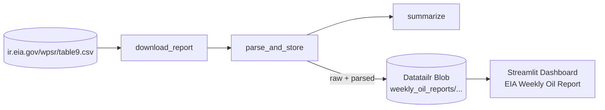

# Weekly Oil Reports on Datatailr

End-to-end pipeline for the EIA **Weekly Petroleum Status Report (Table 9)**.
A scheduled Datatailr workflow downloads the report each week, stores it in
blob storage, and a Streamlit app renders KPIs, time series, and per-section
drill-downs.

## Architecture



The workflow runs **Wed/Thu/Fri at 16:00 UTC** — EIA publishes the WPSR on
Wednesday around 10:30 AM ET, with Thu/Fri retries in case publication slips.
Storage is keyed by the report's week-ending date, so repeated runs are
idempotent (existing reports are not re-parsed).

## Repository layout

```text
weekly_oil_reports/
├── deploy.py                       # Top-level deploy (workflow + dashboard)
├── requirements.txt
├── common/
│   └── parser.py                   # CSV -> long-format DataFrame, blob keys
├── ingest_workflow/
│   ├── tasks.py                    # @task: download / parse_and_store / summarize
│   └── deploy.py                   # @workflow with weekly Schedule
└── dashboard/
    └── app.py                      # Streamlit dashboard
```

## Blob storage layout

```text
weekly_oil_reports/
  raw/YYYY-MM-DD.csv               # Verbatim CSV from EIA, by week-ending date
  parsed/YYYY-MM-DD.parquet        # Long-format tidy data
```

The parsed parquet has columns: `report_date`, `as_of_date`, `column_type`,
`category`, `series`, `value`. `column_type` is one of `weekly_current`,
`weekly_prior`, `weekly_year_ago`, `weekly_year_ago_2`,
`four_week_avg_current`, `four_week_avg_year_ago`.

## Dashboard features

- **KPI cards** for the latest report — domestic production, refiner inputs,
  refinery utilization, commercial crude stocks, gasoline demand, crude
  exports — each with WoW and YoY deltas.
- **Time series** across every stored weekly report for any
  (section, series) pair, with a 4-week moving average overlay.
- **Section snapshot** — pivot any section's latest report into a wide table
  with WoW % and YoY % columns.
- **Refinery utilization by region (PADD)** — horizontal bar chart for the
  most recent week.
- **One-off fetch button** in the sidebar to grab the latest report on demand
  (handy on first deploy before the workflow has fired).

## Deploying

```bash
python weekly_oil_reports/deploy.py            # workflow + dashboard
python weekly_oil_reports/deploy.py workflow   # workflow only
python weekly_oil_reports/deploy.py dashboard  # dashboard only
```

After deploy, click **Fetch latest now** in the dashboard sidebar to populate
blob storage immediately, or wait for the next scheduled workflow run.
